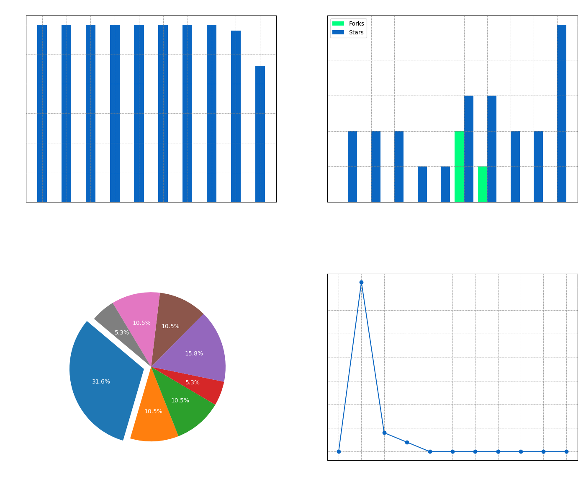

<!--  -->

## Hey 👋, I'm Dika!

I love exploring new tech stacks and leveraging them to build cool things. 

  
### 🧐 More About Me:

- 🔭 &nbsp; I’m currently studying on **University**.
- 🌱 &nbsp; I’m currently learning Blockchain.
- 💬 &nbsp; Ask me about anything tech related, I am happy to help.
- 📝 &nbsp; Checkout my [Medium](#latest-medium-post).

### Languages and Tools:

  
  
  
  
  
  
  
  
  
  
  
  
  
  
  
  
  
  
  
  
  

### Visualizations

  
The generated figure displays four charts side by side:

  
1. **Commits per Repository**: Shows the number of commits for each repository.
2. **Forks & Stars per Repository**: Compares the number of forks and stars for each repository.
3. **Top Languages**: A pie chart showing the distribution of the top programming languages used across all repositories.
4. **Commits per Month**: A line chart showing the number of commits over the past 12 months, up to the current month.

### Contributions

### Latest Medium Post

<!--START_SECTION:medium-->

<table style="width: 100%; border-collapse: collapse;">
  <tr>
    <th style="border: 1px solid white; padding: 10px;">Summary</th>
    <th style="border: 1px solid white; padding: 10px;">Thumbnail</th>
  </tr>
  <tr>
    <td style="border: 1px solid white; padding: 10px;"><h3><a href="https://medium.com/@dikaelsaputra/digital-input-f39f8790aa60?source=rss-272e0aace4a6------2" target="_blank" style="text-decoration: none;">Digital Input</a></h3>
Push Button dan LED, Keypad 4x4 dan LCDDigital input merupakan salah satu dasar penting dalam pemrog...
</td>
    <td style="border: 1px solid white; padding: 10px;"></td>
  </tr>
  <tr>
    <td style="border: 1px solid white; padding: 10px;"><h3><a href="https://medium.com/@dikaelsaputra/dhcp-server-configuration-ubuntu-server-24-04-implementation-guide-6c0d3a7a68ef?source=rss-272e0aace4a6------2" target="_blank" style="text-decoration: none;">DHCP Server Configuration: Ubuntu Server 24.04 Implementation Guide</a></h3>
Team 2 — Praktikum Konfigurasi dan Administrasi Sistem JaringanDidokumentasikan oleh:Ida Faizatun Za...
</td>
    <td style="border: 1px solid white; padding: 10px;"></td>
  </tr>
  <tr>
    <td style="border: 1px solid white; padding: 10px;"><h3><a href="https://medium.com/@dikaelsaputra/running-led-bolak-balik-457fec81b822?source=rss-272e0aace4a6------2" target="_blank" style="text-decoration: none;">Running LED Bolak-Balik</a></h3>
Latihan/Tugas LED Running Bolak-Balik ArduinoPercobaan ini merupakan lanjutan dari latihan dasar mik...
</td>
    <td style="border: 1px solid white; padding: 10px;"></td>
  </tr>
</table>

<!--END_SECTION:medium-->

  <h3><a href="https://medium.com/@dikaelsaputra" target="_blank" style="text-decoration: none;">--- More ---</a></h3>

