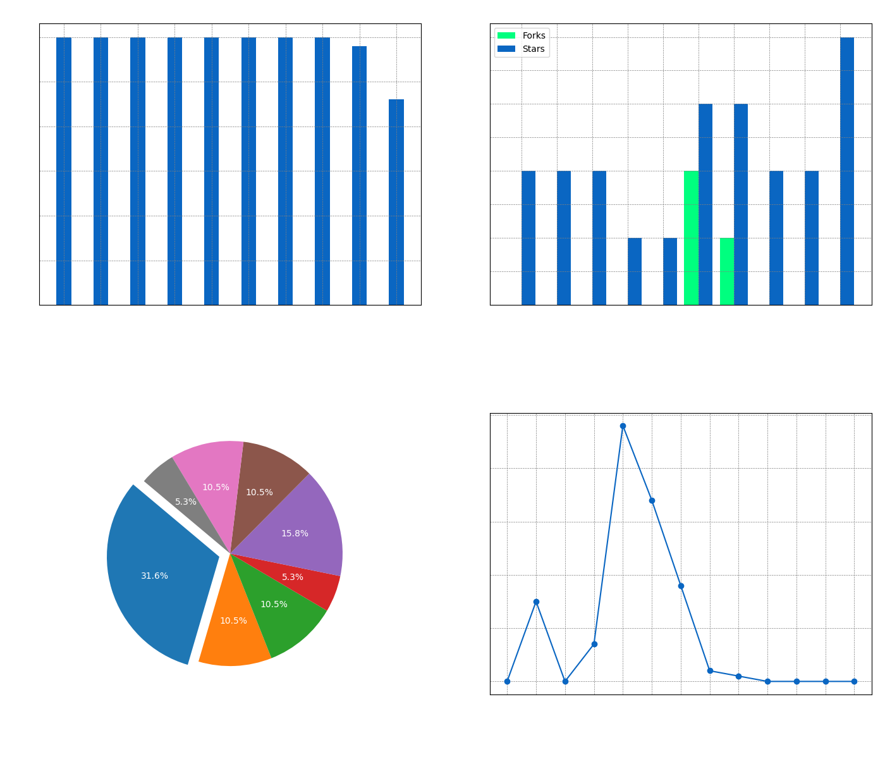

## Hey 👋, I'm Dika!

  <a href="https://www.linkedin.com/in/dika-elsaputra-8a35462a7/" style="text-decoration:none;">
     
    <!--  -->
</a>
  

I am an adaptable person to different topics, Web Developer, App Developer, Entry-level Designer depending on what the project entails. I love exploring new tech stacks and leveraging them to build cool things. 

  
### 🧐 More About Me:

- 🔭 &nbsp; I’m currently studying on **University**.
- 🤝 &nbsp; I’m looking to collaborate on [NextAnimeJS](https://github.com/figuran04/nextanimejs).
- 🌱 &nbsp; I’m currently learning Typescript.
- 👨🏻‍💻 &nbsp; Most of my projects are available on [Github](https://github.com/figuran04?tab=repositories).
- 💬 &nbsp; Ask me about anything tech related, I am happy to help.
- 📫 &nbsp; Feel free to ping me on [LinkedIn](https://www.linkedin.com/in/dika-elsaputra-8a35462a7/).
- 📝 &nbsp; Checkout my [Medium](#medium-post).

### 📊 Visualizations

The generated figure displays four charts side by side:

1. **Commits per Repository**: Shows the number of commits for each repository.
2. **Forks & Stars per Repository**: Compares the number of forks and stars for each repository.
3. **Top Languages**: A pie chart showing the distribution of the top programming languages used across all repositories.
4. **Commits per Month**: A line chart showing the number of commits over the past 12 months, up to the current month.

### ⚫ Medium Post

<!--START_SECTION:medium-->

<!--END_SECTION:medium-->

### 🔧 Languages and Tools:

  
  
  
  
  
  
  
  
  
  
  
  
  
  
  
  
  
  
  
  
  

